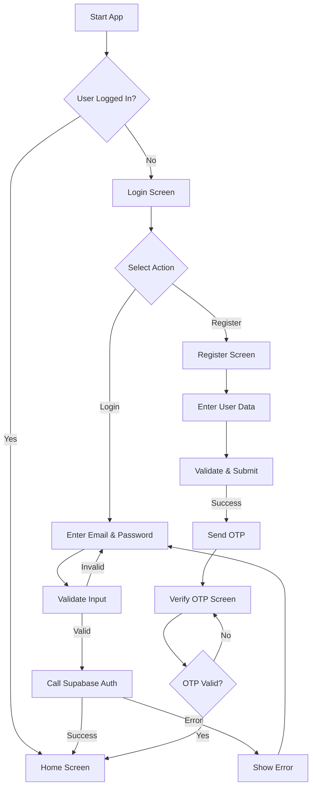
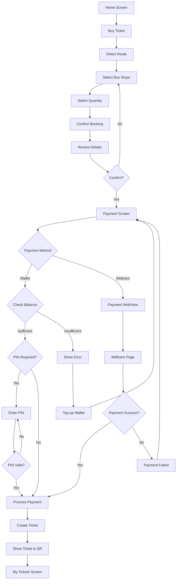
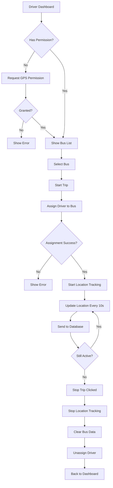
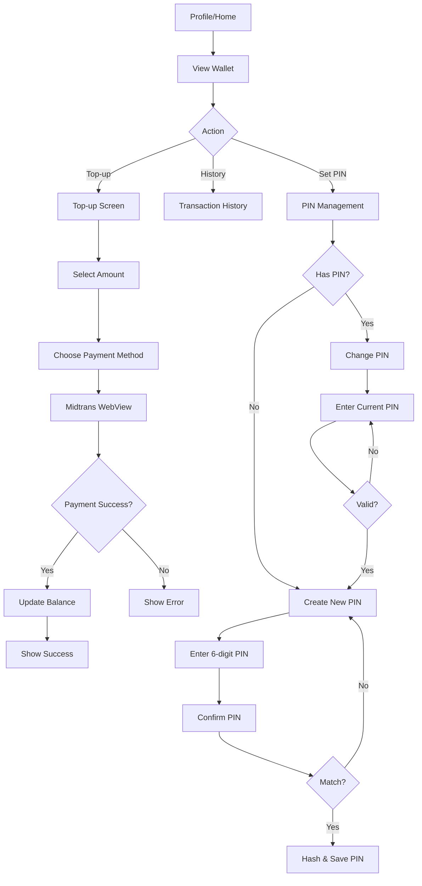
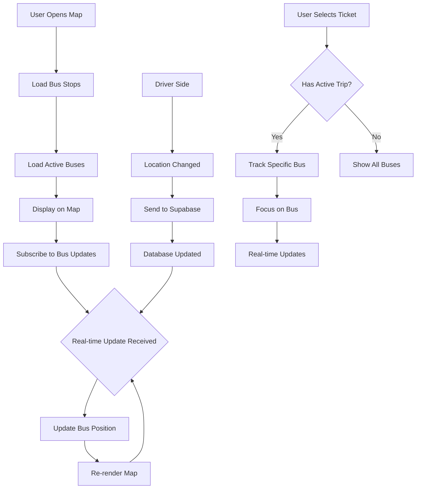

# Dokumentasi Fitur GerakKita

Dokumentasi lengkap untuk semua fitur aplikasi GerakKita - aplikasi bus tracking dan pembelian tiket berbasis React Native dengan Expo.

## 📱 Tentang GerakKita

GerakKita adalah aplikasi mobile untuk tracking bus real-time dan pembelian tiket bus secara digital. Aplikasi ini dibangun dengan React Native dan Expo, menggunakan Supabase sebagai backend, dan terintegrasi dengan Midtrans untuk payment gateway.

## 📋 Daftar Fitur

### 1. Sistem Autentikasi
- Login dengan email/password
- Register akun baru
- Verifikasi OTP untuk keamanan
- Integrasi dengan Supabase Auth
- Social login (Google, Facebook) - status disabled

### 2. Halaman Utama (Home/Beranda)
- Dashboard utama dengan informasi user
- Tampilan saldo wallet
- Quick actions (Buy Ticket, My Tickets, Explore Routes, Help)
- Peta dengan marker halte terdekat
- Pencarian halte terdekat berdasarkan lokasi GPS
- Daftar rute bus yang tersedia
- Refresh untuk update data

### 3. Pembelian Tiket
- Pilih rute bus
- Pilih halte keberangkatan dan tujuan
- Pilih jumlah tiket
- Konfirmasi booking dengan detail perjalanan
- Validasi rute dan halte

### 4. Sistem Pembayaran
- Pilihan metode pembayaran (Wallet, QRIS, GoPay, ShopeePay)
- Integrasi Midtrans Payment Gateway
- Payment WebView untuk menampilkan halaman pembayaran
- Redirect handling setelah pembayaran
- Validasi status transaksi
- Pembuatan tiket otomatis setelah pembayaran sukses

### 5. Tiket Saya
- Daftar tiket aktif dan yang sudah digunakan
- Filter tiket berdasarkan status
- Detail tiket dengan QR code
- Informasi rute, halte, dan waktu perjalanan
- Tracking bus real-time jika tersedia
- Batalkan tiket (jika belum digunakan)

### 6. Peta & Tracking Bus
- Integrasi Google Maps
- Marker halte bus
- Marker bus yang sedang beroperasi
- Real-time location tracking untuk bus aktif
- Informasi halte (nama, lokasi)
- Navigasi ke halte terdekat

### 7. Mode Driver
- Driver dashboard
- Pilih bus untuk mengoperasikan
- Start/Stop trip
- Real-time location tracking & update ke database
- Status online/offline driver
- Informasi bus yang sedang dikendarai
- Permission handling untuk GPS

### 8. Wallet & Top-up
- Tampilan saldo wallet
- Top-up saldo dengan Midtrans
- History transaksi wallet
- Sistem keamanan PIN 6 digit
- Set/Change PIN wallet
- Validasi PIN sebelum pembayaran

### 9. History & Riwayat
- History pembelian tiket
- Filter berdasarkan tanggal
- Detail transaksi lengkap
- Status pembayaran
- Wallet transaction history

### 10. Profil & Settings
- Informasi profil user
- Edit nomor telepon
- Edit/Ganti PIN wallet
- Help Center dengan FAQ
- Privacy Policy
- Logout

### 11. Review & Rating
- Daftar review untuk rute/bus
- Filter review berdasarkan rating
- Submit review baru dengan rating bintang
- Edit/Delete review sendiri

### 12. Eksplorasi Rute
- Pencarian rute bus
- Detail rute dengan daftar halte
- Informasi harga tiket
- Informasi jam operasional
- Lihat lokasi halte di map

---

## 🛠️ Tech Stack

### Frontend Framework
- **React Native** (v0.81.5) - Framework mobile cross-platform
- **React** (v19.1.0) - Library UI component
- **Expo** (v54.0.31) - Platform untuk development React Native
- **Expo Router** (v6.0.21) - File-based routing untuk navigasi

### UI & Styling
- **@expo/vector-icons** - Icon library (Ionicons, MaterialIcons, dll)
- **React Native Reanimated** (v4.1.1) - Animasi performa tinggi
- **React Native Gesture Handler** (v2.28.0) - Gesture handling
- **React Native Safe Area Context** (v5.6.0) - Safe area handling

### Maps & Location
- **React Native Maps** (v1.20.1) - Integrasi Google Maps
- **Expo Location** (v19.0.8) - GPS & geolocation services

### State Management
- **Zustand** (v5.0.10) - State management library ringan
- **React Hooks** - useState, useEffect, useContext, custom hooks

### Backend & Database
- **Supabase** (@supabase/supabase-js v2.90.1) - Backend as a Service
  - PostgreSQL database
  - Authentication & authorization
  - Real-time subscriptions
  - Row Level Security (RLS)
  - Storage untuk file/gambar

### Payment Gateway
- **Midtrans** - Payment gateway untuk Indonesia
  - QRIS
  - GoPay
  - ShopeePay
  - Virtual Account (jika ada)

### Storage & Security
- **Expo Secure Store** (v15.0.8) - Encrypted storage untuk sensitive data (PIN, tokens)
- **Async Storage** (v2.2.0) - Local storage untuk app data
- **Expo Crypto** (v15.0.8) - Hashing untuk PIN wallet

### Other Libraries
- **React Native QRCode SVG** (v6.3.21) - Generate QR code untuk tiket
- **React Native WebView** (v13.15.0) - WebView untuk payment gateway
- **Date-fns** (v4.1.0) - Date manipulation & formatting
- **Expo Image Picker** (v17.0.10) - Upload foto profil
- **Expo Haptics** (v15.0.8) - Haptic feedback

### Development Tools
- **TypeScript** (v5.9.2) - Static typing
- **Jest** (v29.7.0) - Unit testing
- **ESLint** (v9.25.0) - Code linting

---

## 📊 Flowchart Aplikasi

### 1. Authentication Flow



### 2. Ticket Booking & Payment Flow



### 3. Driver Mode Flow



### 4. Wallet & Top-up Flow



### 5. Real-time Bus Tracking Flow



### 6. Complete User Journey

```mermaid
flowchart LR
    A[Download App] --> B[Register/Login]
    B --> C[Explore Routes]
    C --> D[Buy Ticket]
    D --> E[Payment]
    E --> F[Get Ticket + QR]
    F --> G[Track Bus]
    G --> H[Board Bus]
    H --> I[Scan QR]
    I --> J[Complete Trip]
    J --> K[Leave Review]
    K --> L[View History]
```



---

## 📁 Struktur Folder Aplikasi

```
GerakKita/
├── app/                        # Struktur aplikasi dengan file-based routing
│   ├── (auth)/                 # Auth screens (login, register, verify-otp)
│   ├── (tabs)/                 # Main tabs (home, buy-ticket, history, profile, dll)
│   ├── booking/                # Booking flow (confirm, payment, payment-webview)
│   ├── driver/                 # Driver mode screens
│   ├── map/                    # Map screens
│   ├── profile/                # Profile settings screens
│   ├── routes/                 # Route detail screens
│   └── wallet/                 # Wallet screens (topup, history)
├── components/                 # Reusable components
│   └── common/                 # Common UI components (Button, Input, Card, dll)
├── lib/                        # Libraries & utilities
│   ├── api/                    # API functions (auth, bookings, routes, wallet, dll)
│   ├── hooks/                  # Custom React hooks
│   ├── store/                  # State management (Zustand)
│   ├── types/                  # TypeScript types & interfaces
│   └── utils/                  # Utility functions & constants
├── assets/                     # Images, icons, fonts
├── dokumentasi/                # Dokumentasi (folder ini)
└── supabase/                   # Supabase migrations & config
```

---

## 🚀 Cara Menjalankan Aplikasi

1. **Install dependencies**
   ```bash
   npm install
   ```

2. **Setup environment variables**
   - Copy file `.env.example` menjadi `.env`
   - Isi variabel environment dengan credentials Supabase dan Midtrans

3. **Start development server**
   ```bash
   npx expo start
   ```

4. **Run di device/emulator**
   - Untuk Android: `npx expo start --android`
   - Untuk iOS: `npx expo start --ios`
   - Untuk web: `npx expo start --web`

---

## 📝 Catatan Tambahan

- Aplikasi menggunakan **Expo Router** untuk file-based routing
- **Supabase** digunakan untuk backend dengan Row Level Security (RLS) yang aktif
- **Midtrans Sandbox** digunakan untuk testing payment gateway
- **Real-time tracking** menggunakan Supabase real-time subscriptions
- **PIN Wallet** di-hash menggunakan Expo Crypto sebelum disimpan
- **QR Code** dibuat untuk setiap tiket menggunakan React Native QRCode SVG

---

## 👥 Kontributor

Proyek ini dikembangkan sebagai aplikasi bus tracking untuk thesis/skripsi.

---

## 📄 Lisensi

Dokumentasi ini dibuat untuk keperluan pendidikan dan development.
