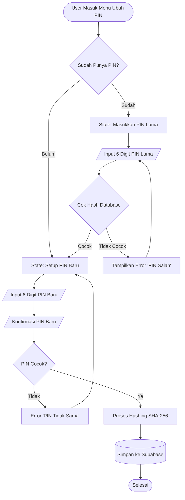
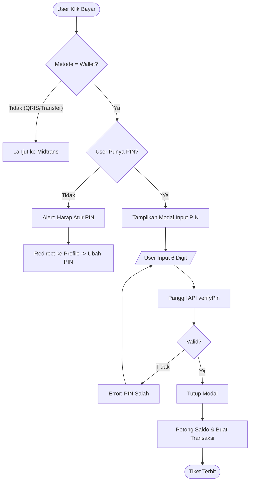

# Dokumentasi Sistem Keamanan PIN Dompet Digital

Dokumen ini menjelaskan arsitektur dan alur kerja sistem **Security PIN** yang diimplementasikan pada aplikasi GerakKita untuk mengamankan transaksi Wallet.

## 1. Ikhtisar Teknis (Technical Overview)

Sistem PIN dirancang untuk memberikan lapisan keamanan tambahan (2FA) sebelum saldo pengguna dipotong.

*   **Panjang PIN**: 6 Digit Angka (Numeric).
*   **Enkripsi**: SHA-256 Hashing. PIN asli **tidak pernah** disimpan di database.
*   **Library**: `expo-crypto` untuk proses hashing di sisi klien (device).
*   **Verifikasi**: Pencocokan hash PIN input dengan hash yang tersimpan di database Supabase.

## 2. Struktur Database

Tabel `users` di Supabase telah diperbarui untuk menyimpan hash PIN.

| Table | Column | Type | Description |
| :--- | :--- | :--- | :--- |
| `users` | `encrypted_pin` | `text` (nullable) | Menyimpan hasil hash SHA-256 dari PIN pengguna. Jika `null`, berarti pengguna belum mengatur PIN. |

## 3. Komponen Utama

Implementasi tersebar di beberapa file berikut:

1.  **`lib/api/security.ts`**: Modul inti yang menangani logika keamanan.
    *   `hashPin(pin)`: Mengubah PIN menjadi SHA-256 hash.
    *   `verifyPin(userId, pin)`: Membandingkan hash input dengan database.
    *   `updatePin(userId, pin)`: Menyimpan hash baru ke database.
    *   `hasPinSet(userId)`: Mengecek apakah user sudah punya PIN.

2.  **`app/profile/edit-pin.tsx`**: Antarmuka pengguna (UI) untuk:
    *   Membuat PIN Baru (jika belum ada).
    *   Mengubah PIN Lama (verifikasi PIN lama dulu).

3.  **`app/booking/confirm.tsx`**: Integrasi pada proses pembayaran.
    *   Mencegah transaksi Wallet jika PIN belum diatur.
    *   Memunculkan Modal Verifikasi PIN sebelum eksekusi pembayaran.

---

## 4. Alur Kerja (Flowchart)

### A. Setup & Ubah PIN
Alur ini menangani logika ketika pengguna masuk ke menu "Ubah PIN". Sistem mendeteksi secara otomatis apakah ini pengaturan awal atau perubahan PIN.

### B. Verifikasi Pembayaran Wallet
Alur ini berjalan saat pengguna memilih metode pembayaran "Saldo GerakPay" di halaman konfirmasi pesanan.

